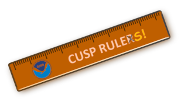
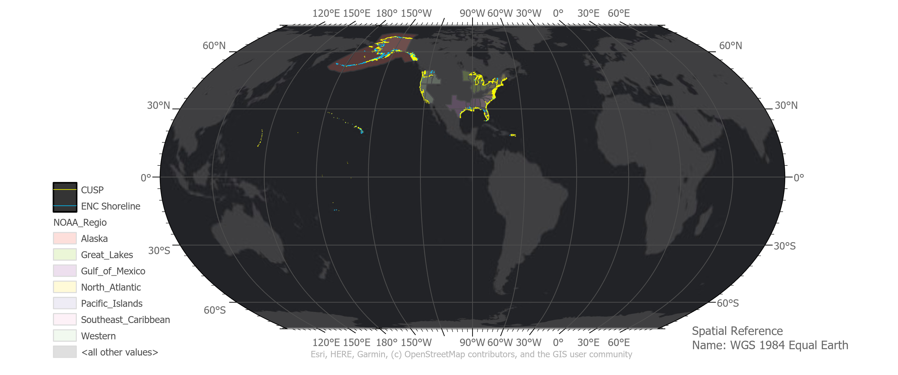
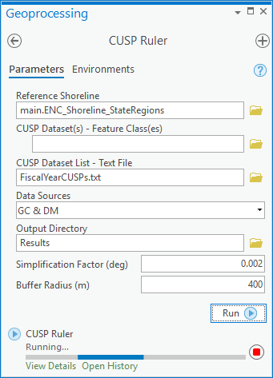
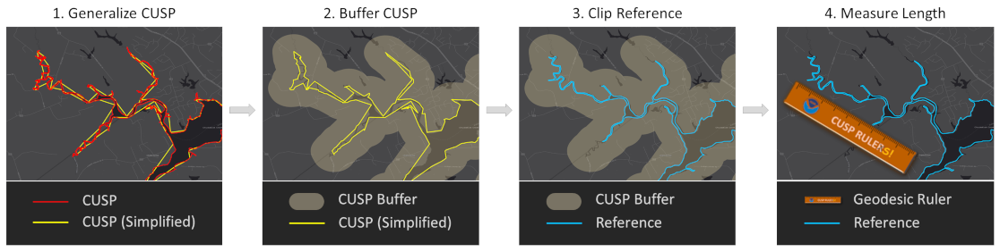
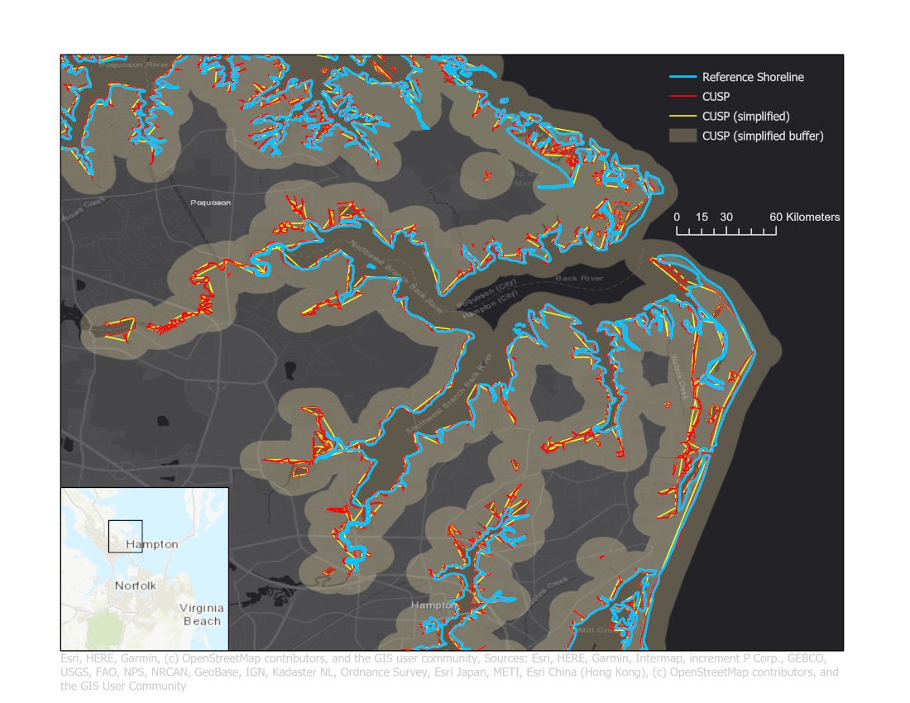

CUSP Ruler
----------

CUSP Ruler is a NOAA Remote Sensing Division ArcPro tool that calculates the length of Continually Updated Shoreline Product (CUSP) relative to a specified reference shoreline.  More information about CUSP is available at https://shoreline.noaa.gov/data/datasheets/cusp.html.

*Continually Updated Shoreline Product (CUSP) Coverage as of October 2019.*

Installation
============

Installing CUSP Ruler consists of 2 main steps:

1. create/configure ArcPro Python environment

2. obtain/load CUSP Ruler toolbox

1. create/configure ArcPro Python environment
+++++++++++++++++++++++++++++++++++++++++++++

1.1 Clone the default ArcPro Python environment by issueing the following command at an Anaconda prompt:
::

  conda create --clone C:\\<> --prefix C:\\<>\cusp_ruler
  
1.2 Install the Python package Geopandas

First, uninstall the default gdal package with the following command (at the Anaconda prompt):
::  

  conda uninstall gdal
  
Second, install the Geopandas package with the following command (at the Anaconda prompt):
::

  conda install geopandas
  
1.3 Configure ArcPro Python environment

Point ArcPro to the newly created CUSP Ruler Python environment, as shown below:

.. image:: ./support_files/installation.png

2. obtain/load CUSP Ruler toolbox
+++++++++++++++++++++++++++++++++

2.1 

GUI
===

CUSP Ruler has three inputs:

=====================   ===================================================================
INPUT                   DESCRIPTION
=====================   ===================================================================
*Reference Shoreline*   feature class containing reference shoreline 
*CUSP*                  feature class containing CUSP  
*Output Directory*      output directory where results table and products will be generated  
=====================   ===================================================================

Basic Workflow
==============

The CUSP Ruler workflow has four main steps:

1.  Generalize the CUSP datashet
++++++++++++++++++++++++++++++++
The CUSP dataset is generalized to computationaly simplify the proceeding steps.  The Geopandas simplify algorithm is used, with a tolerance of 0.002 (degrees) and perserve_topology=False.

2. Buffer the generalized CUSP datashet
+++++++++++++++++++++++++++++++++++++++
The CUSP data are buffered as a way to determine which reference shoreline segments correspond to the CUSP data.  The reference shoreline segments intersecting the CUSP buffer are considered to correspond to CUSP.  To preserve distances during the buffering process, the simplified CUSP data are buffered (using the shapely buffer method) with each line segment transformed to a local azimuthal equidistant projection.  

NOTE:  Applying a local azimuthal equidistant projection to each line might be unnecessay.  Future development plans include looking at appling a local azimuthal equidistant projection on a regional basis.

3. Clip reference shoreline with CUSP buffer
++++++++++++++++++++++++++++++++++++++++++++
The reference shoreline is clipped with the CUSP buffer using the Geopandas intersecion method.

4. Measure geodesic lengths of clipped reference shoreline
++++++++++++++++++++++++++++++++++++++++++++++++++++++++++
The geodesic lengths of the clipped reference shoreline segments are calcualted using the inverse method of the cartopy package.

Output
======

The main output is an ASCII table summarizing the kilometers of CUSP per NOAA region, per state by state.  The summary table has five columns:

=============   =============================================================
COLUMN          DESCRIPTION
=============   =============================================================
*stateName*     state abbreviation
*noaaRegion*    NOAA region
*ClippedLeng*   the length of reference shoreline corresponding to CUSP (km)
*StateLeng*     the total length of reference shoreline (km)
*Percentage*    the percentage of reference shoreline with corresponding CUSP 
=============   =============================================================

*Example Summary Table (partial)*
::

  stateName,noaaRegion,ClippedLeng,StateLeng,Percentage;    

  IL,Great Lakes,378,394,0.96;

  IN,Great Lakes,177,210,0.84;

  MI,Great Lakes,8267,8902,0.93;

  MN,Great Lakes,399,431,0.92;

  NY,Great Lakes,1757,1814,0.97;

  OH,Great Lakes,937,995,0.94;

  PA,Great Lakes,129,129,1.0;

  WI,Great Lakes,2396,2920,0.82;

  CT,North Atlantic,1075,1086,0.99;

  DE,North Atlantic,1378,1619,0.85;

Secondary outputs include the simplified CUSP and corresponding buffer (see example below).  The secondary output layers are provided as layers within an OGC geopackage (https://www.geopackage.org/).

